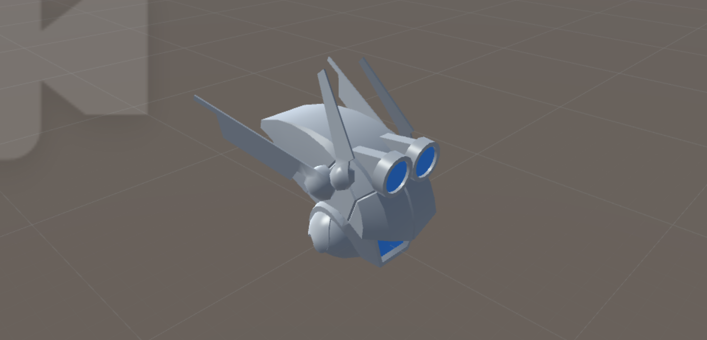
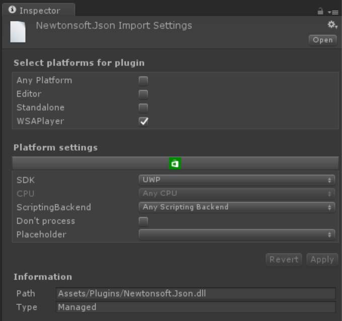

# HoloBot
A sample Unity project for [Microsoft HoloLens](http://hololens.com) that lets you interact with a floating robot head using speech recognition, and getting answers spoken back by the "bot" using Text-to-Speech. The commands sent to the bot are powered by the [Microsoft Bot Framework](https://dev.botframework.com/) and [LUIS](https://www.microsoft.com/cognitive-services/en-us/language-understanding-intelligent-service-luis) from [Microsoft Cognitive Services](https://www.microsoft.com/cognitive-services).

To get started with HoloLens, visit the [Windows Holographic Dev Center](https://developer.microsoft.com/windows/holographic).

## Feature
- Hovering bot head (aka HoloBot) with looping sound
- Tap the HoloBot to move it to a different location, tap again to place
- Gaze at the HoloBot to trigger the speech recognizer, you will hear a "Ping" sound
- Speak "commands" using natural language
- The HoloBot speaks back to you using Speech Synthesis (aka Text-to-Speech, or TTS)
- All sounds and speech use spatial audio that originate from the HoloBot
- The "brain" of the HoloBot can be any public bot built with the [Microsoft Bot Framework](https://dev.botframework.com/)

## Instructions / Notes
- The HoloBot model and sounds come from the [Holographic Academy](https://developer.microsoft.com/en-us/windows/holographic/academy) tutorial: [Holograms 240: Sharing Holograms](https://developer.microsoft.com/en-us/windows/holographic/holograms_240)
- Uses Gaze Manager & Gesture Manager from [HoloLens Unity Toolkit](https://github.com/microsoft/HoloToolkit-Unity) (Input scripts)
- Uses Text to Speech Manager from [HoloLens Unity Toolkit](https://github.com/microsoft/HoloToolkit-Unity) (Utilities scripts)
- Make sure to copy a UWP build of **Newtonsoft.Json.dll** in the **/Plugins** folder of the HoloBot Unity project
- Edit the Inspector settings for the **Newtonsoft.Json.dll** plugin as follows:

## Connecting your Bot to HoloBot
- Create and register your bot as per the intructions at https://dev.botframework.com. Since HoloBot uses free natural language dictation, it is highly recommended that your bot support NLP via [Natural Language Understanding Service](https://www.microsoft.com/cognitive-services/en-us/language-understanding-intelligent-service-luis) (LUIS) from [Microsoft Cognitive Services](https://www.microsoft.com/cognitive-services)
- Enable the Direct Line channel on your bot
- Generate and copy your Direct Line secret (aka API key)
- Open **BotService.cs** in the **/Scripts** folder of the HoloBot Unity project and paste your Direct Line secret in the **_APIKEY** private string

## Acknowledgments
I want to offer special thanks to the following people who have helped me in building this sample app:
- [Jarez Bienz](https://github.com/jbienzms), for the Text-to-Speech component that he wrote the the HoloLens Unity Toolkit, and for his help in integrating my UWP Bot Framework code into Unity
- [Kat Haris](https://github.com/KatVHarris), for her awesome Unity skills and helping me with audio sources triggers
- The whole Microsoft Holographic Academy team & mentors - especially Pat - for their awesome training, resources, patience and help

## Follow Me
* Twitter: [@ActiveNick](http://twitter.com/ActiveNick)
* Blog: [AgeofMobility.com](http://AgeofMobility.com)
